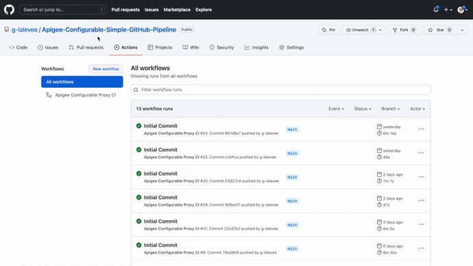

[](https://shields.io/)  


# Apigee Simple Github Pipeline for Configurable Proxy

**This is not an official Google product.**<BR>This implementation is not an official Google product, nor is it part of an official Google product. Support is available on a best-effort basis via GitHub.

***

## Goal

Simple implementation for a CI/CD pipeline for Apigee Configurable Proxy using GitHub repository, 
[CI/CD with GitHub](https://docs.GitHub.com/ee/ci/introduction/) and gcloud command (GitHub Action).

The CICD pipeline includes:

- Integration testing of the deployed proxy using
  [apickli](https://github.com/apickli/apickli)
- Deployment of the API Configurable Proxy bundle using
  [setup-gcloud GitHub Action](https://github.com/google-github-actions/setup-gcloud)


### API Proxy and Apigee configuration

The folder [./proxy](./proxy) includes a simple Configurable API proxy bundle, as well as the following resources:

- [GitHub Action Workflow File](.github/workflows/apigee-ci.yml) to define a GitHub Action CI pipeline.
- [test Folder](./test) to hold the integration tests (Apickli).


## Target Audience

- Operations
- API Engineers
- Security


## Limitations & Requirements

- The authentication to the Apigee X management API is done using a GCP Service Account. See [CI/CD Configuration Instructions](#CI/CD-Configuration-Instructions).


## Prerequisites

### Apigee Configurable Environment

This CI/CD pipeline is an example of an Apigee proxy deployment to a configurable environment of an Apigee X organization. <BR>
If you are not familiar with Configurable Environment, please first read Apigee documentation [Configurable API proxies](https://cloud.google.com/apigee/docs/api-platform/develop/configurable-api-proxies).<BR>
If you don't have a Configurable environment, you have first to provision one. See [Provision an Apigee environment](https://cloud.google.com/apigee/docs/api-platform/develop/create-configurable-proxy#provision-an-apigee-environment).


## CI/CD Configuration Instructions


### Google Cloud: Create Service Account

Apigee X deployement requires a GCP Service Account with the following roles (or a custom role with all required permissions):

- Apigee Environment Admin

To create it in your Apigee organization's GCP project, use following gcloud commands (or GCP Web UI):

```sh
SA_NAME=<your-new-service-account-name>

gcloud iam service-accounts create $SA_NAME --display-name="GitHub-ci Service Account"

PROJECT_ID=$(gcloud config get-value project)
GitHub_SA=$SA_NAME@$PROJECT_ID.iam.gserviceaccount.com

gcloud projects add-iam-policy-binding "$PROJECT_ID" \
  --member="serviceAccount:$GitHub_SA" \
  --role="roles/apigee.environmentAdmin"

gcloud projects add-iam-policy-binding "$PROJECT_ID" \
  --member="serviceAccount:$GitHub_SA" \
  --role="roles/apigee.apiAdmin"

gcloud iam service-accounts keys create $SA_NAME-key.json --iam-account=$GitHub_SA --key-file-type=json 

```

Copy `<your-new-service-account-name>-key.json` file content to clipboard. 


### GitHub: Initialize Repository

Create a GitHub repository to hold your API Proxy. 

To use the `Apigee-Configurable-Simple-GitHub-Pipeline` in your GitHub repository like `github.com/my-user/my-api-proxy-repo`, follow these steps:

```bash
git clone git@github.com:g-lalevee/Apigee-Configurable-Simple-GitHub-Pipeline.git
cd Apigee-Configurable-Simple-GitHub-Pipeline
git init
git remote add origin git@github.com:my-user/my-api-proxy.git
git checkout -b feature/cicd-pipeline
git add .
git commit -m "initial commit"
git push -u origin feature/cicd-pipeline
```


### GitHub: Secret Configuration 

Add GitHub secrets `GCP_CREDENTIALS` to store your GCP Service Account json key::
- Go to your repository’s **Settings** > **Secrets** > **Action**.
- Click the **New Repository Secret** button.<BR>Fill in the details:
  - Name: GCP_CREDENTIALS
  - Value: paste the GCP Service Account file content, copied step before
  - Click the **Add secret** button


## Run the pipeline

Using your favorite IDE...
1.  Update the **.github/workflows/apigee-ci.yml** file.<BR>
In **"env"** section (workflow level)...
    - change `APIGEE_ORG` value by your target Apigee X organization name
    - change `APIGEE_CONFIG_ENV` value by your target Apigee X configurable environment name
    - change `TEST_HOST` value by the hostname used to call API Proxy once deployed (integration test)

---
**NOTE**

The **proxy** folder is the base of your Configurable API proxies file structure, as shown in the following figure:

```sh
.
└── proxy
    └── src
        └── main
            └── apigee
               ├── apiproxies
               |    └── hipster-conf 
               |        └── config.yaml
               └── environments
                    └── ENVIRONMENT-NAME
                        ├── deployment.json
                        └── targetservers.json
```

In this sample, we replaced the folder with the name of the target environment (and containing its configuration) by a variable : it will be automatically replaced by the value of `APIGEE_CONFIG_ENV`

---

3. Save
4. Commit, Push.. et voila!

Use the GitHub UI to monitor your pipeline execution:

- Go to your GitHub repository > **Actions** (tab). You can see your workflow running.<BR>Download apicki test results at the end.

<BR>&nbsp;<BR>


